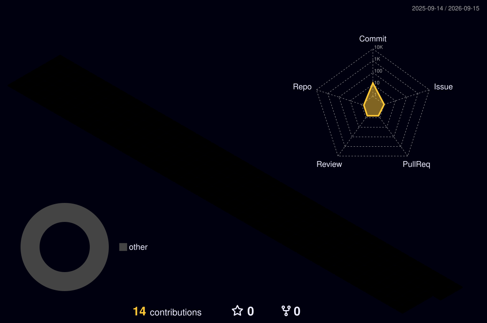

 

사용자의 일상에 닿는 웹과 앱을 만듭니다.

React Native와 JavaScript로 아이디어를 구현하고, 
보기 좋은 화면과 쓰기 편한 경험을 함께 고민합니다.

 

프로젝트 둘러보기 ↗

02 / Toolbox

  

  

UI & Mobile · JavaScript / HTML / CSS / React Native
Data & Tools · Firebase / Python / Java / Git

 

 

<samp>Thoughtful interfaces. Meaningful experiences.</samp>

